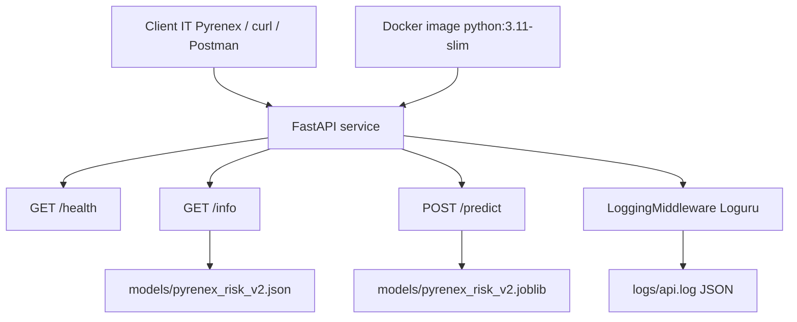

# M1-B2 — Pyrenex Risk API

API FastAPI conteneurisée qui expose le modèle de scoring crédit `pyrenex_risk_v2.joblib` produit en M1-B1.

Le service fournit trois routes principales :

| Route | Méthode | Rôle |
|---|---:|---|
| `/health` | GET | Vérifie que le modèle est chargé |
| `/info` | GET | Expose la version API et les métadonnées modèle |
| `/predict` | POST | Retourne une prédiction de risque de défaut |

## Architecture



## Démarrage en 3 commandes

```bash
docker build -t pyrenex-risk-api:v0.1.0 .
docker run --rm -p 8000:8000 --name pyrenex-risk-api pyrenex-risk-api:v0.1.0
curl http://localhost:8000/health
```

Réponse attendue :

```json
{"status":"ok"}
```

## Exemple `/predict`

```bash
curl -X POST http://localhost:8000/predict \
  -H "Content-Type: application/json" \
  -d '{
    "loan_amnt": 10000.0,
    "int_rate": 12.5,
    "installment": 334.2,
    "annual_inc": 55000.0,
    "dti": 18.5,
    "delinq_2yrs": 0.0,
    "fico_range_low": 690.0,
    "revol_util": 45.2,
    "term": "36 months",
    "grade": "B",
    "home_ownership": "RENT",
    "verification_status": "Verified",
    "purpose": "debt_consolidation",
    "emp_length": "10+ years"
  }'
```

Réponse attendue :

```json
{
  "prediction": 0,
  "probability": 0.5999567347112214,
  "model_version": "v2.0.0",
  "request_id": "3dd2b5ea-667c-472b-9dd3-4c44951670de"
}
```

## `/info`

```bash
curl http://localhost:8000/info
```

La route expose les informations nécessaires à la traçabilité :

```json
{
  "api_version": "0.1.0",
  "model_name": "pyrenex_risk_v2",
  "model_version": "v2.0.0",
  "created_at": "2026-07-06T12:40:44.631157+00:00",
  "sklearn_version": "1.5.1",
  "dataset_sha256": "d2da093bee40024b196e73a0d2d763193782f947e3d60552a3d7bbad0bd944e3",
  "metrics_holdout": {
    "f1_macro": 0.613,
    "f1_default": 0.4364,
    "roc_auc": 0.7371,
    "recall_default": 0.6455
  }
}
```

## Tests

Tests locaux :

```bash
python -m pytest -v
```

Tests dans le conteneur :

```bash
docker run --rm \
  -v "$(pwd)/tests:/home/appuser/app/tests" \
  pyrenex-risk-api:v0.1.0 \
  python -m pytest -v
```

Résultat validé :

```text
7 passed
```

## Logs

Les logs applicatifs sont écrits dans :

```text
logs/api.log
```

Le middleware Loguru produit des logs JSON structurés sans body de requête, afin d'éviter toute fuite de PII.

Schéma FastIA attendu :

```text
timestamp, level, method, path, status, latency_ms, request_id
```

Le `request_id` est aussi renvoyé dans toutes les réponses via le header :

```text
X-Request-ID
```

## Versionning

Version API :

```text
0.1.0
```

Version modèle :

```text
v2.0.0
```

La version modèle est servie par `/info` depuis :

```text
models/pyrenex_risk_v2.json
```

Tag Git attendu pour la livraison :

```text
v0.1.0-api
```

## Préparation M5

Cette version M1-B2 embarque le modèle directement dans l'image Docker.

Pour M5, les évolutions naturelles seront :

- ajouter une CI/CD GitHub Actions ;
- publier l'image dans un registry ;
- ajouter une authentification réelle autour du HTTPBearer ;
- séparer éventuellement l'image applicative et l'artefact modèle ;
- préparer un monitoring plus complet en production.
